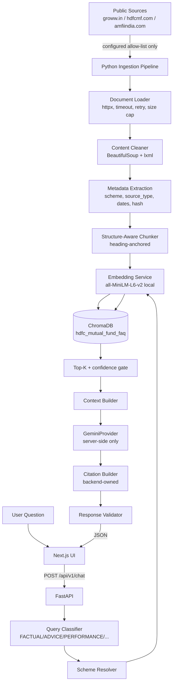
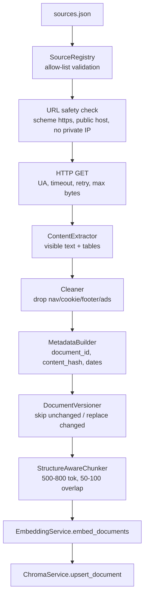
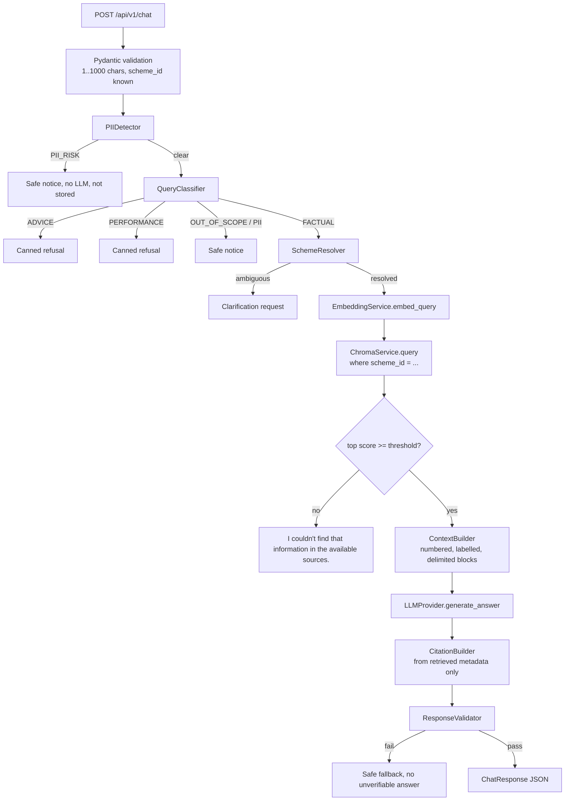
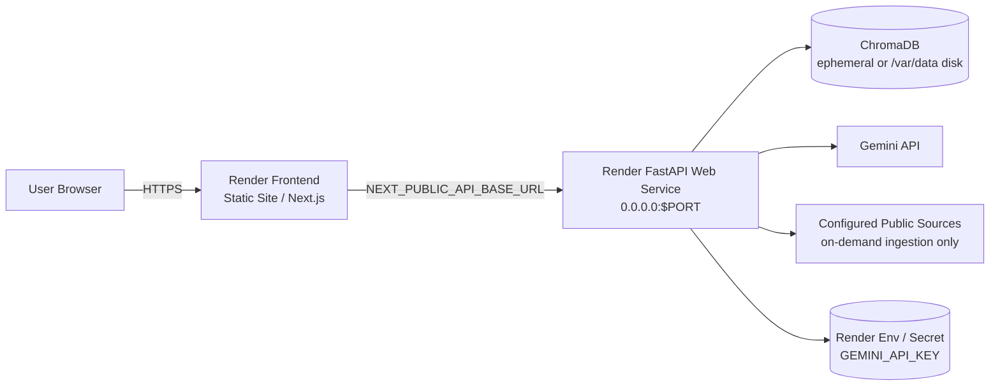

# ARCHITECTURE — HDFC Fund Facts

Python/FastAPI RAG service + Next.js frontend. This document describes the two pipelines, the
component boundaries, the security model, and the deployment topologies.

---

## 1. System Context



## 2. Pipeline A — Ingestion (offline, CLI)



**Idempotency contract.** `document_id = sha256(scheme_id | normalized_url)[:16]`.
`content_hash = sha256(normalized_text)`. `chunk_id = sha256(document_id | ordinal | chunk_text)[:32]`.

| Case | Behaviour |
| --- | --- |
| Document absent from store | Fetch → embed → upsert all chunks |
| Document present, `content_hash` identical | **Skip** — no re-download of embeddings, no new chunks |
| Document present, `content_hash` differs | Delete all chunks for that `document_id` → re-chunk → re-embed → upsert |
| Document removed from `sources.json` | With `--prune`, its chunks are deleted |
| Re-run with no source change | Zero writes, zero duplicates |

This is why re-running `python scripts/ingest.py` is safe.

## 3. Pipeline B — Retrieval (online, per request)



Only `FACTUAL` queries with sufficient retrieval confidence ever reach Gemini. This is the primary
cost, latency, and hallucination control: refusals and empty retrievals never call the LLM.

## 4. Backend Layout

```
backend/
├── app/
│   ├── main.py                     FastAPI app factory, middleware, lifespan
│   ├── api/routes/                 chat.py  health.py  schemes.py  sources.py  (thin)
│   ├── core/
│   │   ├── config.py               pydantic-settings, env parsing, validation
│   │   ├── logging.py              structured logs, redaction, request context
│   │   ├── security.py             CORS, request size/id, URL allow-list validation
│   │   └── errors.py               domain exceptions -> HTTP mapping
│   ├── models/                     chat.py  retrieval.py  source.py  enums.py
│   ├── services/
│   │   ├── rag/                    service.py retriever.py context_builder.py
│   │   │                           citation_builder.py chunker.py validator.py
│   │   ├── embeddings/             embedding_service.py
│   │   ├── llm/                    base.py (LLMProvider ABC)  gemini.py  factory.py
│   │   ├── ingestion/              loader.py cleaner.py extractor.py metadata.py
│   │   │                           chunker.py pipeline.py registry.py
│   │   └── safety/                 classifier.py scheme_resolver.py pii.py guardrails.py
│   └── dependencies/services.py     singletons: embedding, chroma, llm, rag
├── scripts/                        ingest.py rebuild_index.py test_retrieval.py evaluate.py
├── tests/                          health, chat, retrieval, ingestion, safety, citations
└── data/                           raw/ processed/ chroma/   (git-ignored)
```

### Layering rules

- **Routes are thin.** They validate via Pydantic, resolve singletons via `Depends`, call
  `RAGService.answer()`, and return a model. No retrieval logic, no prompting, no chunking.
- **Services own behaviour.** `RAGService` orchestrates; `Retriever` embeds+queries; `ContextBuilder`
  formats; `CitationBuilder` builds citations; `ResponseValidator` verifies.
- **Singletons only.** Embedding model, Chroma client/collection, and the Gemini client are created
  once in the FastAPI lifespan (or lazily in scripts) and reused. Nothing heavy per request.
- **Configuration only, never constants.** Model names, thresholds, paths, origins come from settings.

## 5. Frontend Layout

```
frontend/
├── app/            App Router: layout.tsx, page.tsx, globals.css
├── components/     Header, WelcomeScreen, ChatPanel, MessageBubble, SourceCard,
│                   SchemeSelector, Composer, AboutPanel, Disclaimer, StatusBadge
└── lib/            api.ts (single fetch client), types.ts, constants.ts
```

The frontend receives structured JSON and renders it. It contains **no** embeddings, vector search,
chunking, prompts, Gemini calls, or retrieval scoring. `lib/api.ts` is the only place a URL is built.

## 6. API Contract

| Method | Path | Purpose |
| --- | --- | --- |
| GET | `/health` | Liveness. No LLM, no embedding work. |
| GET | `/api/v1/schemes` | Configured schemes → drives the selector and the indexed badge. |
| GET | `/api/v1/sources` | Indexed documents with source type, doc type, URL, last updated. |
| POST | `/api/v1/chat` | `{message, scheme_id?}` → `{answer, sources[], last_updated, query_type}` |

`retrieval: {chunks_used, confidence}` is included only when `DEBUG_RAG=true` (non-production).
Error bodies are `{"detail": "..."}` with a safe message — never a traceback.

## 7. Safety Design

### 7.1 Query classification (deterministic, pre-LLM)

| Class | Examples | Behaviour |
| --- | --- | --- |
| `FACTUAL` | "minimum SIP?", "benchmark?", "lock-in?" | Retrieve → Gemini |
| `ADVICE` | "should I invest?", "which fund should I buy?" | Canned refusal, no LLM |
| `PERFORMANCE` | "which returns more?", "what will I get?" | Canned refusal, no ranking |
| `PII_RISK` | PAN / Aadhaar / folio / OTP / account | Safe notice, text not forwarded |
| `OUT_OF_SCOPE` | jokes, weather, unrelated | "Not in the available sources" |

### 7.2 Prompt-injection defence

- The system prompt declares a **facts-only** role; user text and retrieved chunks are wrapped and
  explicitly labelled untrusted data.
- Retrieved text cannot redefine the role, add sources, or request a recommendation.
- The LLM is instructed never to emit URLs; **the backend attaches citations itself**, so injected
  "cite https://evil.example" text can never become a link in the UI.
- Post-generation validation scans for recommendation/performance phrasing and strips it.

### 7.3 Secrets

`GEMINI_API_KEY` is read server-side from the environment (local `.env`, Render env var). It is
never in source, never in a `NEXT_PUBLIC_*` variable, never logged, never returned, and is
git-ignored along with `.env`, `.env.local`, `*.secret`, `secrets/`, `json.secret`. Startup logs
print *that* configuration loaded, never its values.

### 7.4 SSRF

The loader ingests **only** URLs from `sources.json`. A guard rejects non-`https`, embedded
credentials, non-standard ports, and hosts that resolve to private/loopback/link-local ranges.
No public endpoint accepts a URL.

## 8. Chroma Deployment Modes

| Mode | Config | Behaviour |
| --- | --- | --- |
| Persistent (local) | `CHROMA_MODE=persistent`, `CHROMA_PERSIST_DIRECTORY=./data/chroma` | Survives restarts |
| Persistent (Render disk) | `CHROMA_MODE=persistent`, `CHROMA_PERSIST_DIRECTORY=/var/data/chroma` | Survives restarts **iff** a disk is mounted at `/var/data` |
| Ephemeral (Render default FS) | `CHROMA_MODE=ephemeral` | **Lost on restart/redeploy.** Optional `AUTO_INGEST_ON_STARTUP=true` re-ingests when empty |

Render's normal service filesystem is ephemeral. A Chroma directory on it is **not** durable. This is
stated plainly rather than hidden. Startup never auto-ingests unless explicitly enabled, so a warm
deploy does not pay download+embedding cost on every boot.

## 9. Deployment Topology



Local: Next.js on `:3000` → FastAPI on `:8000`. Same env var names, different values.

## 10. Performance Strategy

- Embedding model, Chroma client, and Gemini client are process singletons.
- Embeddings are batched (`encode_documents`) and normalized once.
- Ingestion embeds per document, not per chunk, and skips unchanged documents entirely.
- Retrieval returns metadata and distances in one call; only the top-K chunk texts enter the prompt.
- `/health` and `/api/v1/schemes` do no model work, so a cold instance stays healthy.
- Latency is logged per stage (retrieval / generation / total) without logging query text.

## 11. Observability

Logged per request: request id, timestamp, route, status, total/retrieval/LLM latency, chunk count,
detected scheme, source ids, classification. Controlled by `LOG_LEVEL`; enriched by `DEBUG_RAG=true`.

Never logged: API keys, full prompts, raw PII, raw financial identifiers, environment dumps.
